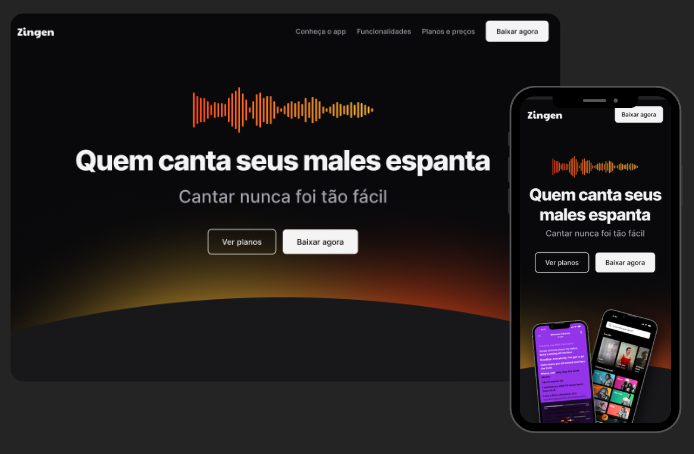

<h1 align="center"> Formulário de Matrícula </h1>

Projeto de estudo desenvolvido para praticar a criação de interfaces web modernas e responsivas. O desafio foi converter um design visual complexo em uma landing page funcional para o aplicativo de canto "Zingen", utilizando HTML5 e CSS. 

  

## 🚀 Tecnologias

Esse projeto foi desenvolvido com as seguintes tecnologias:

- HTML e CSS
- Git e Github
- Figma

- [Acesse o projeto finalizado online!](https://vhbiten.github.io/ProjectStudy_ResponsiveLandingPage_Zingen/)
